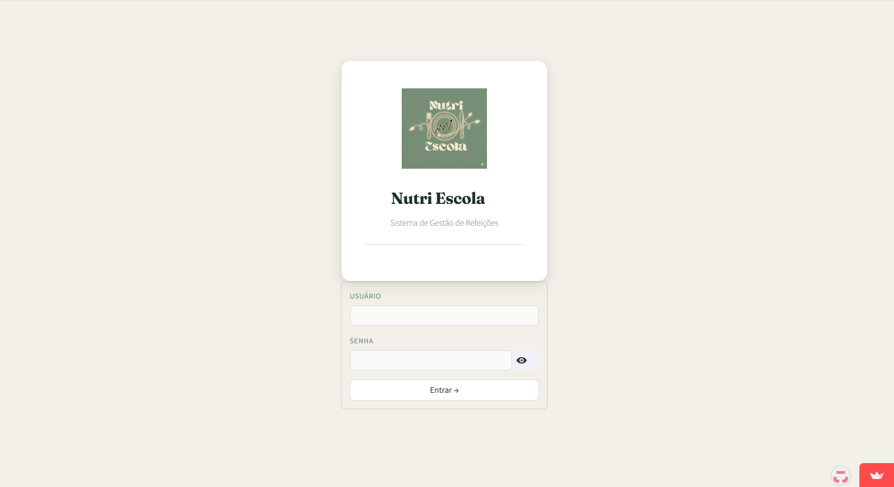
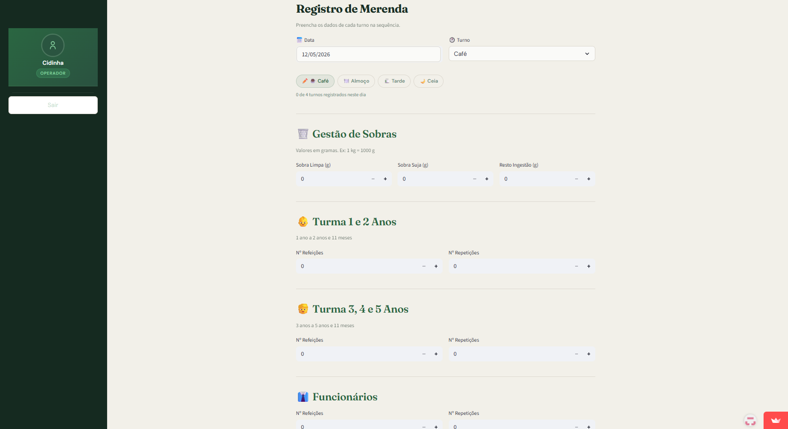
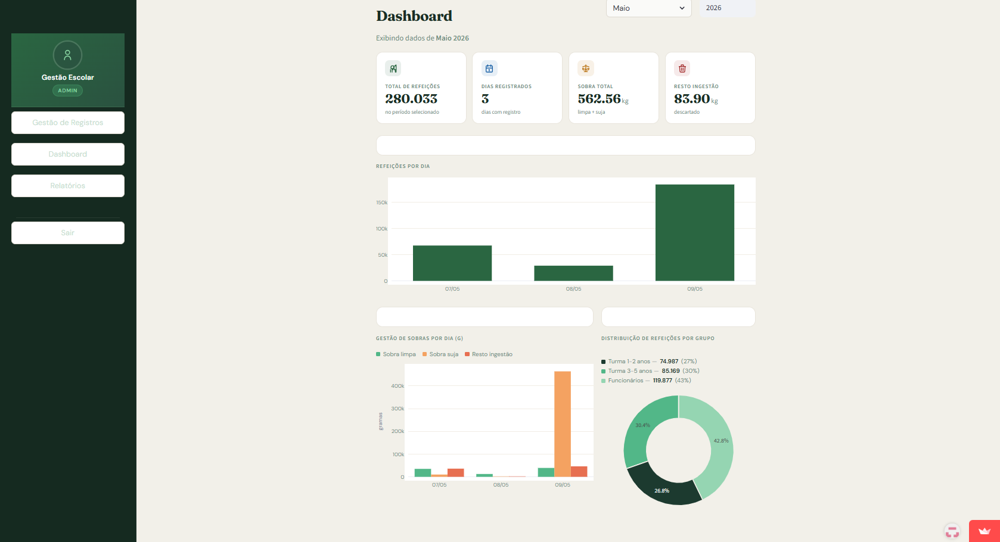
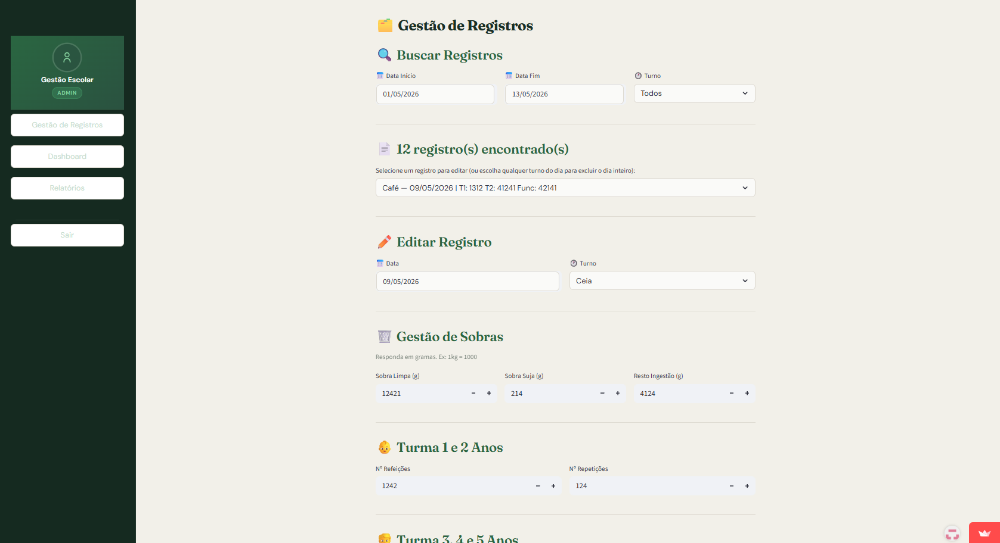
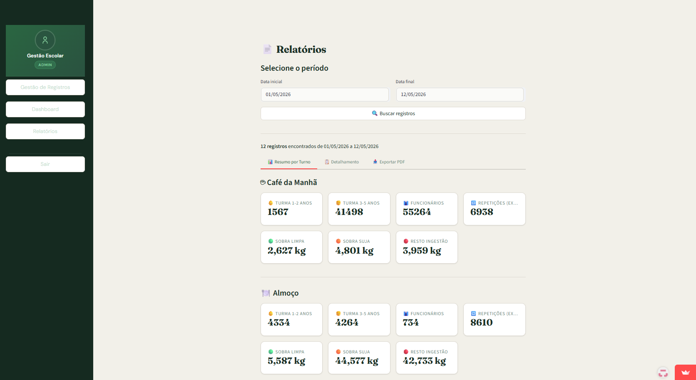

# 🍽️ NutriEscola

> Sistema web de gestão de merenda escolar — controle de refeições, sobras e relatórios por turno.

[](https://nutriescolaemeicastelo.streamlit.app/)


---

## 📸 Telas

### Login


### Registro de Merenda — Perfil Operador


### Dashboard — Perfil Admin


### Gestão de Registros


### Relatórios


---

## 💡 Sobre o Projeto

O **NutriEscola** foi desenvolvido para facilitar o controle diário da merenda escolar em instituições de ensino infantil. O sistema permite que operadores registrem os dados de cada refeição por turno, enquanto administradores acompanham os dados em tempo real via dashboard e relatórios.

---

## ✨ Funcionalidades

- 🔐 **Autenticação por perfil** — acesso diferenciado para Admin e Operador
- 📝 **Registro por turno** — Café, Almoço, Tarde e Ceia com controle de sequência
- 🗑️ **Gestão de sobras** — sobra limpa, sobra suja e resto ingestão em gramas
- 👶 **Controle por faixa etária** — Turma 1-2 anos, Turma 3-5 anos e Funcionários
- 📊 **Dashboard interativo** — gráficos de refeições por dia, distribuição por grupo e gestão de sobras
- 📄 **Relatórios detalhados** — resumo por turno com exportação em PDF
- ✏️ **Gestão de registros** — busca, edição e exclusão de lançamentos
- 📱 **Responsivo** — funciona em desktop e dispositivos móveis

---

## 🛠️ Tecnologias

| Tecnologia | Uso |
|---|---|
| [Python 3.11](https://python.org) | Linguagem principal |
| [Streamlit](https://streamlit.io) | Framework web e UI |
| [Supabase](https://supabase.com) | Banco de dados PostgreSQL |
| [Plotly](https://plotly.com) | Gráficos interativos |
| [Pandas](https://pandas.pydata.org) | Manipulação de dados |
| [OpenPyXL](https://openpyxl.readthedocs.io) | Exportação para Excel |

---

## 🏗️ Arquitetura

```
nutriescola/
├── main.py              # App principal, autenticação e roteamento
├── database.py          # Conexão e queries Supabase
├── views/
│   ├── registro.py      # Tela de registro (operador)
│   ├── gestao.py        # Gestão de registros (admin)
│   ├── dashboard.py     # Dashboard com gráficos (admin)
│   └── relatorios.py    # Relatórios e exportação (admin)
├── assets/
│   └── logo.png
└── requirements.txt
```

---

## 👥 Perfis de Acesso

| Perfil | Acesso |
|---|---|
| **Operador** | Registro de merenda por turno |
| **Admin** | Gestão, Dashboard e Relatórios completos |

---

## 🚀 Deploy

O app está hospedado no **Streamlit Cloud** com banco de dados **Supabase**.

👉 **[Acessar NutriEscola](https://nutriescolaemeicastelo.streamlit.app/)**

---

<p align="center">Feito com 💚 para a gestão da merenda escolar</p>
